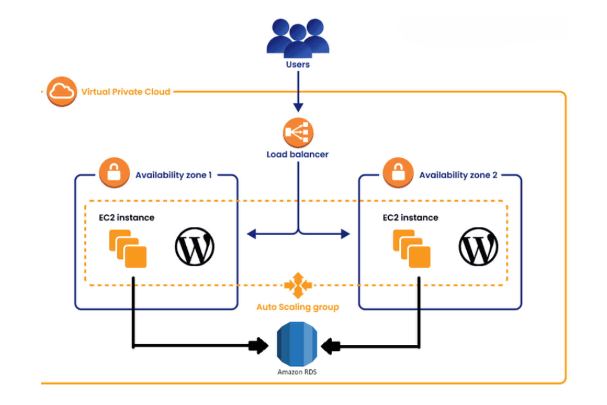

# Arquitetura Escalável e Resiliente do WordPress na AWS com Docker

Este repositório contém um guia completo para configurar uma arquitetura escalável e resiliente do WordPress na AWS usando Docker. A arquitetura foi projetada para garantir alta disponibilidade, escalabilidade e segurança, aproveitando serviços da AWS como EC2, RDS, EFS, Auto Scaling Groups e contêineres Docker.

## Índice

- [Visão Geral da Arquitetura](#visão-geral-da-arquitetura)
- [Pré-requisitos](#pré-requisitos)
- [Serviços AWS Utilizados](#serviços-aws-utilizados)
- [Etapas de Implementação](#etapas-de-implementação)
  - [1. Configuração de Rede (VPC e Sub-redes)](#1-configuração-de-rede-vpc-e-sub-redes)
  - [2. Configuração de Grupos de Segurança](#2-configuração-de-grupos-de-segurança)
  - [3. Configuração do Amazon RDS MySQL](#3-configuração-do-amazon-rds-mysql)
  - [4. Configuração do Amazon EFS](#4-configuração-do-amazon-efs)
  - [5. Criar Template de Inicialização com Script de User Data](#5-criar-template-de-inicialização-com-script-de-user-data)
  - [6. Configuração do Auto Scaling Group](#6-configuração-do-auto-scaling-group)
  - [7. Configuração do Application Load Balancer](#7-configuração-do-application-load-balancer)
  - [8. Teste e Validação](#8-teste-e-validação)
- [Ajustes Realizados](#ajustes-realizados)
  - [Regra de Entrada para NFS](#regra-de-entrada-para-nfs)
  - [Roteamento para Sub-redes Privadas](#roteamento-para-sub-redes-privadas)
  - [Resolução e Hostnames DNS](#resolução-e-hostnames-dns)
  - [Script de User Data Atualizado](#script-de-user-data-atualizado)
- [Conclusão](#conclusão)
- [Licença](#licença)

---

## Visão Geral da Arquitetura



A arquitetura consiste em:

- **VPC** com sub-redes públicas e privadas distribuídas em duas Zonas de Disponibilidade.
- **Instâncias EC2** executando contêineres Docker hospedando o WordPress.
- **Auto Scaling Group (ASG)** para gerenciar as instâncias EC2.
- **Amazon RDS** com banco de dados MySQL para armazenamento persistente.
- **Amazon EFS** para armazenamento compartilhado de arquivos entre as instâncias EC2.
- **Application Load Balancer (ALB)** para distribuir o tráfego de entrada.
- **Grupos de Segurança** para controlar o tráfego de rede.

---

## Pré-requisitos

- Uma conta AWS com permissões necessárias para criar recursos.
- AWS CLI instalado e configurado (opcional, mas recomendado).
- Conhecimento básico de serviços AWS e Docker.
- Git instalado na sua máquina local.

---

## Serviços AWS Utilizados

- **Amazon VPC**
- **Amazon EC2**
- **Amazon RDS (MySQL)**
- **Amazon EFS**
- **Auto Scaling Group**
- **Application Load Balancer**
- **Grupos de Segurança**

---

## Etapas de Implementação

### 1. Configuração de Rede (VPC e Sub-redes)

#### 1.1 Criar uma VPC

- **Nome:** `WordPressVPC`
- **CIDR IPv4:** `10.0.0.0/16`

#### 1.2 Criar Sub-redes

- **Sub-rede Pública 1:**
  - **Nome:** `PublicSubnet1`
  - **Zona de Disponibilidade:** `us-east-1a`
  - **CIDR:** `10.0.1.0/24`
- **Sub-rede Pública 2:**
  - **Nome:** `PublicSubnet2`
  - **Zona de Disponibilidade:** `us-east-1b`
  - **CIDR:** `10.0.2.0/24`
- **Sub-rede Privada 1:**
  - **Nome:** `PrivateSubnet1`
  - **Zona de Disponibilidade:** `us-east-1a`
  - **CIDR:** `10.0.3.0/24`
- **Sub-rede Privada 2:**
  - **Nome:** `PrivateSubnet2`
  - **Zona de Disponibilidade:** `us-east-1b`
  - **CIDR:** `10.0.4.0/24`

#### 1.3 Criar um Internet Gateway

- **Nome:** `WordPressIGW`
- **Anexar** à `WordPressVPC`.

#### 1.4 Criar um NAT Gateway

- **Alocar um Elastic IP.**
- **Criar NAT Gateway** em uma das sub-redes públicas (por exemplo, `PublicSubnet1`).
- **Anexar** à `WordPressVPC`.

#### 1.5 Configurar Tabelas de Roteamento

- **Tabela de Roteamento Pública:**
  - **Rotas:**
    - `0.0.0.0/0` via `WordPressIGW`
  - **Associações:**
    - `PublicSubnet1`
    - `PublicSubnet2`
- **Tabela de Roteamento Privada:**
  - **Rotas:**
    - `0.0.0.0/0` via `NAT Gateway`
  - **Associações:**
    - `PrivateSubnet1`
    - `PrivateSubnet2`

#### 1.6 Habilitar Suporte a DNS

- Nas configurações da VPC, certifique-se de que **Enable DNS resolution** e **Enable DNS hostnames** estejam configurados como **Yes**.

---

### 2. Configuração de Grupos de Segurança

#### 2.1 Grupo de Segurança para o Load Balancer (`ALB-SG`)

- **Regras de Entrada:**
  - **Tipo:** HTTP
  - **Protocolo:** TCP
  - **Faixa de Portas:** 80
  - **Origem:** `0.0.0.0/0`
- **Regras de Saída:**
  - **Permitir todo o tráfego de saída**

#### 2.2 Grupo de Segurança para Instâncias EC2 (`EC2-SG`)

- **Regras de Entrada:**
  - **Tipo:** HTTP
  - **Protocolo:** TCP
  - **Faixa de Portas:** 80
  - **Origem:** `ALB-SG` (referência ao grupo de segurança)
  - **Tipo:** NFS
  - **Protocolo:** TCP
  - **Faixa de Portas:** 2049
  - **Origem:** `EFS-SG` (grupo de segurança do EFS)
- **Regras de Saída:**
  - **Permitir todo o tráfego de saída**

#### 2.3 Grupo de Segurança para RDS (`RDS-SG`)

- **Regras de Entrada:**
  - **Tipo:** MySQL/Aurora
  - **Protocolo:** TCP
  - **Faixa de Portas:** 3306
  - **Origem:** `EC2-SG`
- **Regras de Saída:**
  - **Permitir todo o tráfego de saída**

#### 2.4 Grupo de Segurança para EFS (`EFS-SG`)

- **Regras de Entrada:**
  - **Tipo:** NFS
  - **Protocolo:** TCP
  - **Faixa de Portas:** 2049
  - **Origem:** `EC2-SG`
- **Regras de Saída:**
  - **Permitir todo o tráfego de saída**

---

### 3. Configuração do Amazon RDS MySQL

#### 3.1 Criar uma Instância RDS

- **Engine:** MySQL
- **Identificador da Instância de BD:** `wordpressdb`
- **Nome de Usuário Mestre:** `admin`
- **Senha Mestre:** `sua_senha_de_bd`
- **VPC:** `WordPressVPC`
- **Grupo de Sub-redes:** Inclua `PrivateSubnet1` e `PrivateSubnet2`
- **Acessibilidade Pública:** `Não`
- **Implementação Multi-AZ:** Sim, para alta disponibilidade
- **Grupos de Segurança:** Anexar `RDS-SG`

---

### 4. Configuração do Amazon EFS

#### 4.1 Criar um Sistema de Arquivos EFS

- **Nome:** `WordPressEFS`
- **VPC:** `WordPressVPC`
- **Modo de Desempenho:** General Purpose
- **Modo de Throughput:** Bursting
- **Disponibilidade e Durabilidade:** Regional

#### 4.2 Criar Pontos de Montagem

- **Sub-redes:** `PrivateSubnet1` e `PrivateSubnet2`
- **Grupos de Segurança:** Anexar `EFS-SG`

---

### 5. Criar Template de Inicialização com Script de User Data

#### 5.1 Criar uma Função IAM para EC2

- **Permissões:**
  - **AmazonEC2RoleforSSM**
  - **AmazonElasticFileSystemFullAccess**
  - **AmazonSSMManagedInstanceCore**

#### 5.2 Criar um Template de Inicialização

- **Nome:** `WordPressLaunchTemplate`
- **AMI:** Amazon Linux 2
- **Tipo de Instância:** `t3.micro` (ajuste conforme necessário)
- **Par de Chaves:** (Opcional para acesso SSH)
- **Interfaces de Rede:**
  - **Grupos de Segurança:** `EC2-SG`
- **Perfil de Instância IAM:** Anexar a Função IAM criada.
- **User Data:** Use o script de user data atualizado fornecido [aqui](#script-de-user-data-atualizado).

---

### 6. Configuração do Auto Scaling Group

#### 6.1 Criar um Auto Scaling Group

- **Nome:** `WordPressASG`
- **Template de Inicialização:** `WordPressLaunchTemplate`
- **Sub-redes da VPC:** `PrivateSubnet1`, `PrivateSubnet2`
- **Balanceamento de Carga:** Anexar ao Application Load Balancer (`WordPressALB`) e ao Grupo de Destino (`WordPressTG`)
- **Verificações de Integridade:** Habilitar verificações de integridade do ELB
- **Políticas de Escalonamento:** Configurar com base na utilização de CPU (por exemplo, escalar quando acima de 70%, reduzir quando abaixo de 30%)
- **Capacidade Desejada:** Iniciar com 2 instâncias
- **Capacidade Mínima:** 2
- **Capacidade Máxima:** 4 (ajuste conforme necessário)

---

### 7. Configuração do Application Load Balancer

#### 7.1 Criar um Application Load Balancer

- **Nome:** `WordPressALB`
- **Esquema:** Voltado para a Internet
- **Listeners:** HTTP na porta 80
- **Zonas de Disponibilidade:** `PublicSubnet1`, `PublicSubnet2`
- **Grupos de Segurança:** `ALB-SG`

#### 7.2 Criar um Grupo de Destino

- **Nome:** `WordPressTG`
- **Tipo de Destino:** Instância
- **Protocolo:** HTTP
- **Porta:** 80
- **VPC:** `WordPressVPC`
- **Verificações de Integridade:**
  - **Caminho:** `/`
  - **Limiar de Saúde:** 5
  - **Limiar de Falha:** 2
  - **Timeout:** 5 segundos
  - **Intervalo:** 30 segundos

#### 7.3 Registrar Alvos

- O Auto Scaling Group registrará automaticamente as instâncias no Grupo de Destino.

---

### 8. Teste e Validação

#### 8.1 Acessar o WordPress via Load Balancer

- Obtenha o nome DNS do Load Balancer.
- Abra um navegador e navegue até `http://<DNS-do-Load-Balancer>`.
- Você deve ver a página de instalação do WordPress.

#### 8.2 Validar o Auto Scaling

- Simule carga para acionar as políticas de escalonamento.
- Verifique se novas instâncias são iniciadas ou terminadas com base na utilização da CPU.

#### 8.3 Testar Alta Disponibilidade

- Encerre manualmente uma instância EC2.
- Confirme se o Auto Scaling Group substitui a instância.
- Certifique-se de que a aplicação permanece acessível durante este processo.

---

## Ajustes Realizados

Durante a implementação, alguns ajustes foram necessários para garantir que a arquitetura funcionasse corretamente.

### Regra de Entrada para NFS

Adicionamos uma regra de entrada para permitir tráfego NFS na porta **2049** no grupo de segurança **EC2-SG**. Isso permite que as instâncias EC2 montem o Amazon EFS.

### Roteamento para Sub-redes Privadas

Verificamos que as sub-redes privadas possuem uma rota para um **NAT Gateway**. Isso é crucial para:

- **Resolver nomes DNS** para serviços como Amazon EFS e repositórios de pacotes.
- **Instalar pacotes adicionais** via `yum` durante o processo de inicialização.

### Resolução e Hostnames DNS

Nas configurações da VPC, tanto **DNS Resolution** quanto **DNS Hostnames** foram habilitados. Isso garante que as instâncias EC2 possam resolver endpoints internos dos serviços AWS e nomes DNS externos.

### Script de User Data Atualizado

O script de user data foi atualizado para lidar com a montagem correta do EFS e garantir que o Docker execute o contêiner do WordPress conforme esperado.

#### `user_data.sh` Atualizado

```bash
#!/bin/bash
# Atualizar e instalar pacotes necessários
sudo yum update -y
sudo yum install -y amazon-efs-utils nfs-utils

# Instalar Docker
sudo amazon-linux-extras install docker -y
sudo systemctl enable docker
sudo service docker start
sudo usermod -a -G docker ec2-user

# Variáveis
EFS_ID=fs-0e3e3735f38bb30d7  # Substitua pelo seu ID do EFS
MOUNT_POINT="/mnt/efs"

# Montar o EFS usando amazon-efs-utils com TLS
sudo mkdir -p ${MOUNT_POINT}
sudo mount -t efs -o tls ${EFS_ID}:/ ${MOUNT_POINT}

# Verificar se o EFS foi montado com sucesso
if mountpoint -q ${MOUNT_POINT}; then
    echo "EFS montado com sucesso em ${MOUNT_POINT}"
else
    echo "Falha ao montar o EFS com TLS. Tentando montar com NFS."

    # Montar usando cliente NFS se o método TLS falhar
    sudo mount -t nfs4 -o nfsvers=4.1,rsize=1048576,wsize=1048576,hard,timeo=600,retrans=2,noresvport ${EFS_ID}.efs.us-east-1.amazonaws.com:/ ${MOUNT_POINT}
    
    # Verificar se a montagem via NFS foi bem-sucedida
    if mountpoint -q ${MOUNT_POINT}; then
        echo "EFS montado com sucesso em ${MOUNT_POINT} usando NFS"
    else
        echo "Erro ao montar o EFS. Verifique a configuração de rede e grupos de segurança."
        exit 1
    fi
fi

# Executar o contêiner Docker do WordPress
sudo docker run -d \
  --name wordpress \
  -p 80:80 \
  -v ${MOUNT_POINT}/html:/var/www/html \
  -e WORDPRESS_DB_HOST=wordpressdb.c7ee0kcmeckx.us-east-1.rds.amazonaws.com:3306 \
  -e WORDPRESS_DB_USER=admin \
  -e WORDPRESS_DB_PASSWORD=sua_senha_de_bd \
  -e WORDPRESS_DB_NAME=wordpressdb \
  wordpress:latest
```

**Observações:**

- Substitua `fs-0e3e3735f38bb30d7` pelo seu ID real do EFS.
- Substitua `wordpressdb.c7ee0kcmeckx.us-east-1.rds.amazonaws.com` pelo endpoint do seu RDS.
- Substitua `sua_senha_de_bd` pela senha mestre do seu RDS.
- O script tenta montar o EFS usando TLS por segurança. Se falhar, faz o fallback para NFS.

---

## Conclusão

Seguindo este guia, você terá uma implantação robusta, escalável e segura do WordPress na AWS usando contêineres Docker. A arquitetura aproveita as melhores práticas da AWS para alta disponibilidade e tolerância a falhas em múltiplas Zonas de Disponibilidade. O Auto Scaling garante que a aplicação possa lidar com cargas variáveis, e o Application Load Balancer distribui o tráfego de forma eficiente enquanto realiza verificações de integridade.

---

## Licença

Este projeto está licenciado sob a Licença MIT - consulte o arquivo [LICENSE](LICENSE) para detalhes.

---

Sinta-se à vontade para contribuir com este projeto enviando issues ou pull requests.
